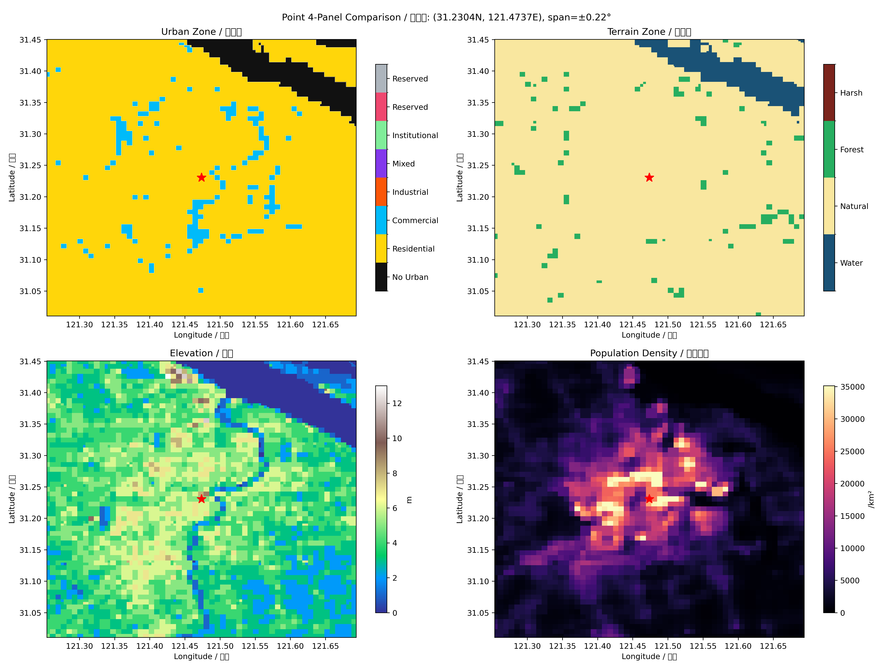
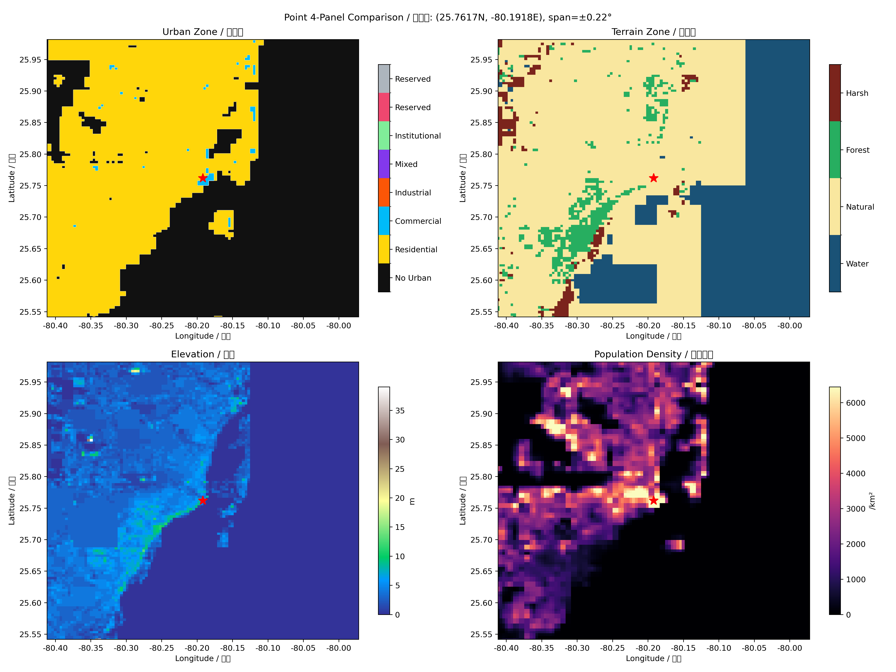
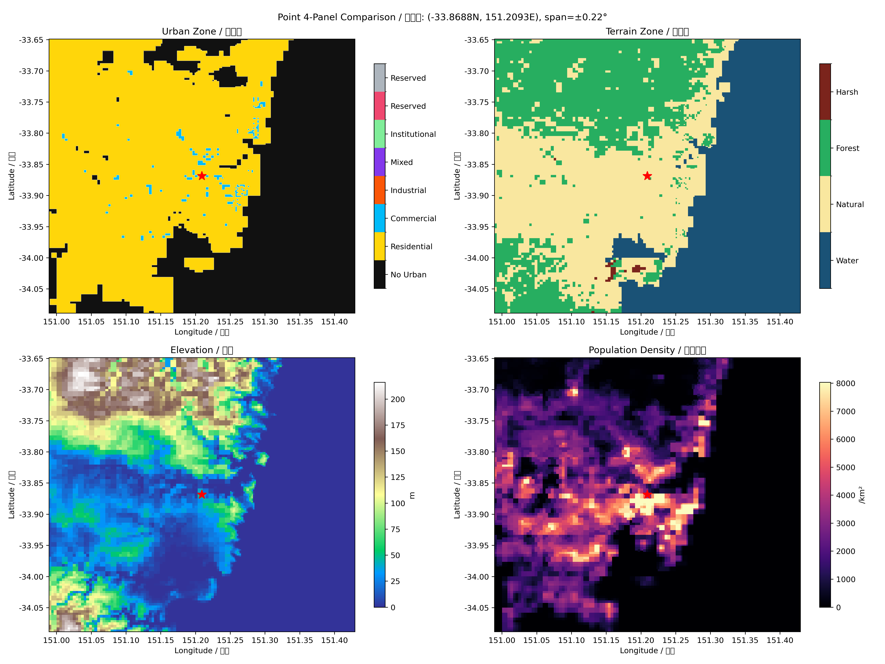
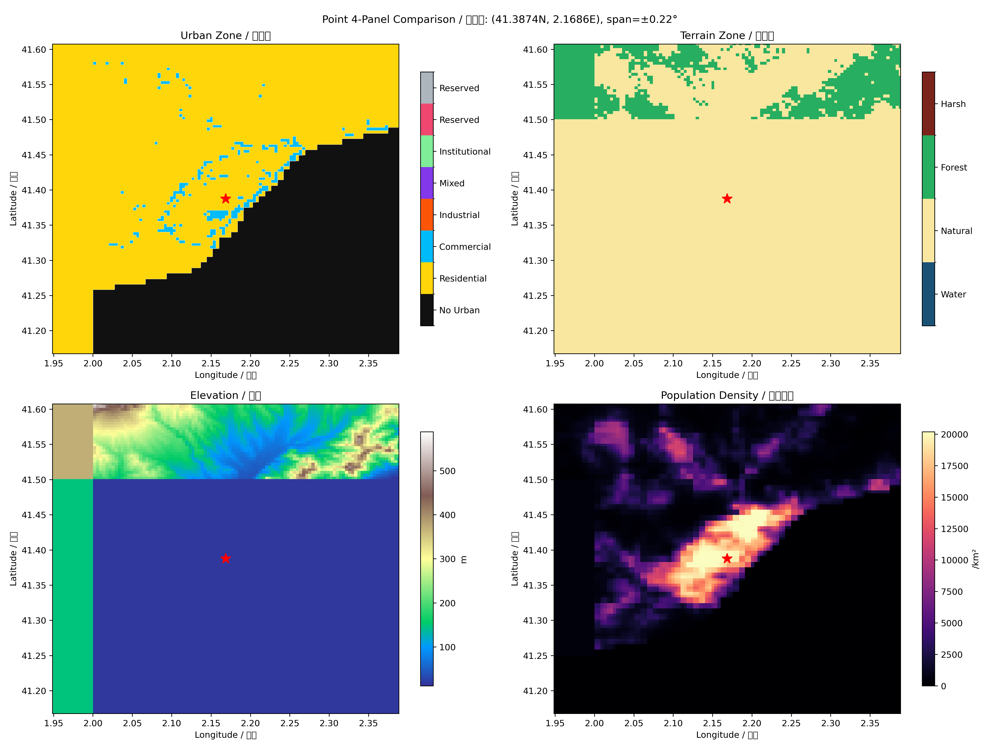
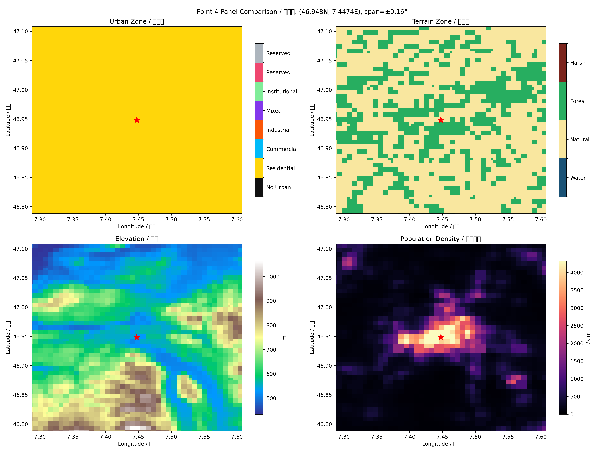

# GeoBaker

将 CopDEM 海拔、WorldPop 人口、ESA WorldCover 地表类型烘焙为紧凑的二进制四叉树瓦片（QTR6 格式（兼容旧 QTR5）），用于游戏、仿真和离线地理查询。

## 当前状态（2026-06）

GeoBaker 目前处在 **QTR6 语义优先四叉树调参阶段**。二进制格式已经稳定，当前主要工作是让瓦片在保留水陆边界、湖泊河流、城市人口和主要地形轮廓的同时，避免 DEM 纹理或地表分类噪声把节点预算打满。

最近一轮代表性验证使用 824 个高风险瓦片，结果如下：

| 指标 | 结果 |
| --- | --- |
| 总数 | 824 |
| 成功烘焙 | 701 |
| 纯海洋跳过 | 39 |
| NO_DATA 待后续处理 | 84 |
| error | 0 |
| terrain 平均节点 | 15,812 |
| terrain p90 / p95 / max | 23,997 / 23,997 / 23,997 |
| terrain near-budget | 223 / 701 = 31.8% |
| population near-budget | 114 / 701 = 16.3% |

这轮验证说明：

- 已解决旧策略里 **非水 terrain zone 纹理无限分裂** 的问题，`split_zone_land` 已从上万级降到个位/几十级。
- 当前尚未达到全量重烘标准；剩余 near-budget 主要来自高山强 relief 的 `split_elevation`，以及湖岸/海岸复杂边界的 `split_zone_water`。
- 澳洲代表区已经明显好转（near-budget 约 6.6%），但南美、中东/高加索、五大湖、日韩样本仍需继续调参。
- 因此当前建议流程仍是：小样本验证 → 代表性列表验证 → 诊断出图 → 通过后再全量重烘。

## 特性

- **多源数据融合**：DEM (30m) + 人口 (1km) + 地表类型 (100m)，默认使用公开数据源，无需项目私有凭据。
- **语义优先自适应四叉树 (QTR6，兼容旧 QTR5)**：16bit 节点、非线性海拔编码、动态节点预算，优先保护水陆/湖河/人口语义。
- **紧凑二进制格式**：支持 zstd 压缩的 GeoPack，360 x 180 网格索引，适合随机访问。
- **水陆一致性处理**：NO_DATA 瓦片可结合 ESA WorldCover 判断水陆，避免盲写水瓦片。
- **沿海城市修正**：用人口栅格辅助修正海岸线附近的水陆误判。
- **增量打包**：仅重新打包新增或变更瓦片。
- **诊断工具**：查询、验证、大小分析、城市抽样验证和可视化出图。

## 展示图（超清样例）

> 以下图片由 `tools/visualize.py compare`（城市四联图）与 `tools/visualize.py quad-overview`（全球四联图）生成。

### 城市四联图（Urban Zone / Terrain Zone / Elevation / Population Density）







### 全球四联图


## 数据源

| 数据 | 来源 | 分辨率 | 认证 |
| --- | --- | --- | --- |
| CopDEM GLO-30 | Planetary Computer / Element84 STAC | 30m | 无需项目私有凭据 |
| Open-Elevation | REST API（降级备用） | ~100m | 无需项目私有凭据 |
| WorldPop | ArcGIS ImageServer | 1km | 无需项目私有凭据 |
| ESA WorldCover | Planetary Computer STAC | 100m | 无需项目私有凭据 |

## 快速开始

```bash
python3 -m venv .venv
source .venv/bin/activate
pip install -r requirements.txt
```

也可以以可编辑模式安装：

```bash
pip install -e .
```

烘焙单个瓦片：

```bash
python -m geo_baker_pkg --tile 116,39
```

查询一个点：

```bash
python -m geo_baker_pkg --query 39.9 116.4
```

查看统计：

```bash
python -m geo_baker_pkg --stats
```

试运行（估算，不下载）：

```bash
python -m geo_baker_pkg --global --dry-run
```

## 用法

### 烘焙（数据处理）

| 命令 | 说明 |
| --- | --- |
| `--tile 116,39` | 烘焙单个 1 度瓦片 |
| `--bbox 70 20 140 55` | 烘焙区域 |
| `--global` | 烘焙全球 |
| `--global --split 2/1` | 分布式烘焙：第 1 份，共 2 份 |
| `--global --bake-ocean` | 不跳过海洋瓦片，下载 DEM 处理 |
| `--global --no-data-water` | NO_DATA 瓦片直接写水瓦片，跳过 zone 检查 |
| `--rebake-list path.txt` | 按 `lon,lat` 列表批量重烘 |
| `--direct-rebake` | `--rebake-list` 的线程直跑模式，适合长任务和后台运行 |
| `--rebake-manifest out.jsonl` | 输出逐瓦片 JSONL 进度和诊断信息 |
| `--retry-errors` | 重试失败瓦片 |
| `--fix-coastal` | 检测并修复沿海问题瓦片 |
| `--fix-pop-zone` | 自动修复人口/城镇与 zone 冲突瓦片 |

### 打包（二进制导出）

| 命令 | 说明 |
| --- | --- |
| `--pack` | 打包地形为 `terrain.dat` |
| `--pack-pop` | 打包人口为 `population.dat` |
| `--incremental-pack` | 增量打包，仅处理新增或变更瓦片 |
| `--merge a.dat b.dat` | 合并两个 `.dat` 文件 |

### 查询

| 命令 | 说明 |
| --- | --- |
| `--query 39.9 116.4` | 从瓦片文件查询海拔 + 人口 |
| `--query-pack 39.9 116.4` | 从 `terrain.dat` 查询 |
| `--query-pop 39.9 116.4` | 仅查询人口 |
| `--stats` | 瓦片统计 |

### 工具

```bash
# 检查与验证
python tools/geo_inspect.py query 39.9 116.4
python tools/geo_inspect.py tile-info 116 39
python tools/geo_inspect.py stats
python tools/geo_inspect.py validate
python tools/geo_inspect.py validate --fix-ocean
python tools/geo_inspect.py size-report
python tools/verify_cities.py --cities data/global_cities.json

# 可视化
python tools/visualize.py elevation --bbox 70 20 140 55 -o china_elev.png
python tools/visualize.py population --bbox 70 20 140 55 -o china_pop.png
python tools/visualize.py zones --bbox 70 20 140 55 -o china_zones.png
python tools/visualize.py overview --pack terrain.dat -o global.png
python tools/visualize.py compare --lat 39.9 --lon 116.4 -o beijing.png
python tools/geo_suite.py quad-view --city 39.9 116.4 --span 1.0 -o beijing_quad.png
python tools/geo_suite.py heatmaps --lat-min 39.75 --lat-max 40.05 --lon-min 116.2 --lon-max 116.6 -o beijing_heatmaps.png
python tools/geo_suite.py geojson --input data/boundary.geojson -o boundary.png
python tools/geo_suite.py verify --check all --pop-threshold 10

# 后台烘焙（低优先级）
bash tools/bake_background.sh
bash tools/bake_background.sh --retry
bash tools/bake_background.sh --region 70 20 140 55
```

## 项目结构

```text
GeoBaker/
├── geo_baker_pkg/               # 核心包
│   ├── core.py                  # 常量、编码、四叉树
│   ├── pipeline.py              # 数据下载、对齐、修正和烘焙编排
│   ├── io.py                    # QTR6/GeoPack 打包和查询
│   └── cli.py                   # 命令行入口
├── tools/                       # 查询、验证、可视化工具
│   ├── geo_inspect.py
│   ├── visualize.py
│   ├── geo_suite.py             # 合并 verify/quad-view/geojson/heatmaps
│   ├── verify_cities.py
│   └── bake_background.sh
├── tests/                       # 单元测试
└── data/                        # 小型元数据，如城市验证列表
```

## 架构

### QTR6 格式（兼容旧 QTR5）（16bit 节点）

```text
地形叶节点: [1bit is_leaf=1][11bit 海拔(非线性)][2bit 坡度][2bit 区域]
人口叶节点: [1bit is_leaf=1][12bit 人口密度(对数)][3bit 城市类型]
分支节点:   [1bit is_leaf=0][15bit subtree_size]
```

- **非线性海拔**：QTR5 为 0-8190m 无符号编码；QTR6 使用同样 11bit 字段表达约 -512m 到 8176m，保留死海、里海沿岸等负海拔陆地。
- **人口编码**：12bit 对数编码，覆盖低密度乡村到高密度城市。
- **DFS 前序遍历**：通过 `subtree_size` 跳过子树，点查询复杂度约为 `O(depth)`。

### 瓦片坐标

每个瓦片覆盖一个整数经纬度单元：

```text
tile lon = floor(longitude)
tile lat = floor(latitude)
terrain filename = tiles/{lon}_{lat}.qtree
population filename = tiles/{lon}_{lat}.pop
```

瓦片内部坐标归一化到 `[0, 1)`。四叉树象限顺序固定为：

```text
0 = NW
1 = NE
2 = SW
3 = SE
```

构建和读取必须保持相同象限顺序。

### 地形四叉树分裂策略

当前地形树的目标不是米级复刻所有 DEM 纹理，而是面向游戏和离线查询保留更稳定的语义边界：

- **强制浅层**：terrain 默认强制到浅层，保证基础空间覆盖稳定。
- **水陆边界优先**：水体与非水体混合时，极小比例的 minority 也会触发 split，用于保护海岸、湖泊和河流边界。
- **非水 zone 降噪**：forest / natural / harsh 等非水分类只保留浅层大块语义，深层不再因 ESA 纹理继续分裂。
- **robust elevation error**：高程 split 使用 `p02 / median / p98` 和标准差，而不是 min/max 尖峰，避免单点 DEM 噪声吃满节点预算。
- **split reason 诊断**：重烘 detail 会输出 `split=elev:... zone_water:... zone_land:... budget_stop:...`，用于判断预算压力来自高程、水体边界还是分类噪声。

### 数据管线

```text
STAC API (CopDEM/ESA) ──┐
WorldPop ArcGIS ────────┤──→ 下载 ─→ 对齐 ─→ 修正 ─→ 四叉树 ─→ 打包 ─→ .dat
                        └── 降级备用数据源
```

### 降级链

- **DEM**：Planetary Computer → Element84 → Open-Elevation
- **地表类型**：ESA WorldCover

### NO_DATA 瓦片处理

当 DEM 下载失败或返回 NO_DATA 时，可以结合 ESA WorldCover 判断水陆：

1. 下载 ESA WorldCover zone 数据。
2. 若水体占比足够高，写 1 字节水瓦片。
3. 否则返回 no_data 状态，等待后续重试或人工检查。
4. `--no-data-water` 可跳过 zone 下载，直接写水瓦片，适合明确知道目标区域是海洋的批处理。

### 沿海城市修正

海岸线附近常见问题是 DEM 或地表分类把有人口的沿海城区标成水。GeoBaker 会用人口作为辅助证据：

1. `fix_water_consistency`：ESA 显式水体和无覆盖区优先保水；只有非保护水体才允许被人口或正高程救回陆地。
2. `_enforce_water_value_consistency`：明显无人口的低洼水体保留为水，同时给负海拔陆地留下编码空间。
3. `_enforce_water_zone_consistency`：水体上的人口和 urban 数据清零。
4. 四叉树构建只编码清理后的 zone，不再在树构建阶段用人口反推水陆。

## 输出格式

### `terrain.dat` / `population.dat` (GeoPack)

| 区域 | 大小 | 说明 |
| --- | --- | --- |
| Header | 32 bytes | Magic、网格维度、瓦片数、标志 |
| Index | 1,036,800 bytes | 360 x 180 网格的 `(offset, size)` 对 |
| Data | 可变 | zstd 压缩的瓦片数据块 |

### 瓦片二进制 (QTR6 / 旧 QTR5)

- **水域瓦片**：1 字节 (`0xFF`)
- **旧 QTR5 数据瓦片**：2 x N 字节，16bit 节点数组，DFS 前序
- **QTR6 数据瓦片**：16 字节格式头 + 2 x N 字节节点数组；节点仍为 16bit，便于旧数据兼容与新数据识别

### 精度说明

- 海拔采用非线性米级桶，优先保留低海拔和常见地形精度。
- 人口采用对数密度编码，避免城市高密度区域被压扁。
- terrain zone 是分类语义层，不应当当作精确边界；游戏逻辑里更建议以海拔、坡度和人口为主判据，zone 作为辅助提示。

## 许可证

MIT License，详见 [LICENSE](LICENSE)。

---

# GeoBaker (English)

GeoBaker bakes CopDEM elevation, WorldPop population, and ESA WorldCover land cover into compact binary quadtree tiles (QTR6 format with legacy QTR5 compatibility) for games, simulations, and offline geospatial queries.

## Current Status (June 2026)

GeoBaker is currently in the **QTR6 semantic-first quadtree tuning stage**. The binary format is stable; the active work is making tile complexity converge naturally while preserving water/land boundaries, lakes and rivers, population semantics, and major terrain shapes.

The latest representative validation used 824 high-risk tiles:

| Metric | Result |
| --- | --- |
| Total | 824 |
| Successfully baked | 701 |
| Ocean skipped | 39 |
| NO_DATA for later handling | 84 |
| Errors | 0 |
| Terrain average nodes | 15,812 |
| Terrain p90 / p95 / max | 23,997 / 23,997 / 23,997 |
| Terrain near-budget | 223 / 701 = 31.8% |
| Population near-budget | 114 / 701 = 16.3% |

What this means:

- The old **non-water terrain-zone texture explosion** is fixed; `split_zone_land` dropped from tens of thousands to single/double digits in typical tiles.
- The project is **not ready for a global rebake yet**. Remaining near-budget pressure mainly comes from high-relief `split_elevation` and complex water-boundary `split_zone_water`.
- Australia is already much better in the representative set (about 6.6% near-budget), while South America, Middle East/Caucasus, Great Lakes, and Japan/Korea still need tuning.
- The recommended workflow remains: small smoke rebake → representative-list rebake → diagnostic renders → global rebake only after validation passes.

## Features

- **Multi-source data fusion**: DEM (30m), population (1km), and land cover (100m), using public data sources by default.
- **Semantic-first adaptive quadtree (QTR6, legacy QTR5 compatible)**: 16-bit nodes, nonlinear elevation encoding, budget-aware splitting, and priority for water/land, lakes/rivers, and population semantics.
- **Compact binary format**: zstd-compressed GeoPack files with a 360 x 180 tile index.
- **Water/land consistency**: optional ESA-based handling for NO_DATA tiles instead of blindly writing water.
- **Coastal city correction**: uses population as supporting evidence for inhabited coastlines.
- **Incremental packing**: re-pack only new or changed tiles.
- **Diagnostic tools**: query, validation, size reports, city sampling, and visualization.

## Showcase (Ultra-HD Samples)

> Images below are generated by `tools/visualize.py compare` (city quad view) and `tools/visualize.py quad-overview` (global quad view).

### City Quad Views (Urban Zone / Terrain Zone / Elevation / Population Density)


### Global Quad View


## Data Sources

| Data | Source | Resolution | Auth |
| --- | --- | --- | --- |
| CopDEM GLO-30 | Planetary Computer / Element84 STAC | 30m | No project-specific credential |
| Open-Elevation | REST API fallback | ~100m | No project-specific credential |
| WorldPop | ArcGIS ImageServer | 1km | No project-specific credential |
| ESA WorldCover | Planetary Computer STAC | 100m | No project-specific credential |

## Quick Start

```bash
python3 -m venv .venv
source .venv/bin/activate
pip install -r requirements.txt
```

Editable install:

```bash
pip install -e .
```

Bake one tile:

```bash
python -m geo_baker_pkg --tile 116,39
```

Query a point:

```bash
python -m geo_baker_pkg --query 39.9 116.4
```

Show stats:

```bash
python -m geo_baker_pkg --stats
```

Dry run:

```bash
python -m geo_baker_pkg --global --dry-run
```

## Usage

### Baking

| Command | Description |
| --- | --- |
| `--tile 116,39` | Bake one 1-degree tile |
| `--bbox 70 20 140 55` | Bake a region |
| `--global` | Bake globally |
| `--global --split 2/1` | Distributed bake, part 1 of 2 |
| `--global --bake-ocean` | Do not skip ocean tiles |
| `--global --no-data-water` | Write NO_DATA tiles as water directly |
| `--rebake-list path.txt` | Batch rebake from a `lon,lat` list |
| `--direct-rebake` | Threaded direct mode for long `--rebake-list` jobs |
| `--rebake-manifest out.jsonl` | Write per-tile JSONL progress and diagnostics |
| `--retry-errors` | Retry failed tiles |
| `--fix-coastal` | Detect and fix coastal problem tiles |
| `--fix-pop-zone` | Auto-fix population/urban vs terrain-zone conflicts |

### Packing

| Command | Description |
| --- | --- |
| `--pack` | Pack terrain into `terrain.dat` |
| `--pack-pop` | Pack population into `population.dat` |
| `--incremental-pack` | Pack only new or changed tiles |
| `--merge a.dat b.dat` | Merge two `.dat` files |

### Querying

| Command | Description |
| --- | --- |
| `--query 39.9 116.4` | Query elevation and population from tile files |
| `--query-pack 39.9 116.4` | Query from `terrain.dat` |
| `--query-pop 39.9 116.4` | Query population only |
| `--stats` | Tile statistics |

### Tools

```bash
# Inspection and validation
python tools/geo_inspect.py query 39.9 116.4
python tools/geo_inspect.py tile-info 116 39
python tools/geo_inspect.py stats
python tools/geo_inspect.py validate
python tools/geo_inspect.py validate --fix-ocean
python tools/geo_inspect.py size-report
python tools/verify_cities.py --cities data/global_cities.json

# Visualization
python tools/visualize.py elevation --bbox 70 20 140 55 -o china_elev.png
python tools/visualize.py population --bbox 70 20 140 55 -o china_pop.png
python tools/visualize.py zones --bbox 70 20 140 55 -o china_zones.png
python tools/visualize.py overview --pack terrain.dat -o global.png
python tools/visualize.py compare --lat 39.9 --lon 116.4 -o beijing.png
python tools/geo_suite.py quad-view --city 39.9 116.4 --span 1.0 -o beijing_quad.png
python tools/geo_suite.py heatmaps --lat-min 39.75 --lat-max 40.05 --lon-min 116.2 --lon-max 116.6 -o beijing_heatmaps.png
python tools/geo_suite.py geojson --input data/boundary.geojson -o boundary.png
python tools/geo_suite.py verify --check all --pop-threshold 10

# Background baking
bash tools/bake_background.sh
bash tools/bake_background.sh --retry
bash tools/bake_background.sh --region 70 20 140 55
```

## Project Structure

```text
GeoBaker/
├── geo_baker_pkg/               # Core package
│   ├── core.py                  # Constants, encoding, quadtree
│   ├── pipeline.py              # Download, align, fix, and bake orchestration
│   ├── io.py                    # QTR6/GeoPack packing and querying
│   └── cli.py                   # CLI entry point
├── tools/                       # Query, validation, and visualization tools
│   ├── geo_inspect.py
│   ├── visualize.py
│   ├── geo_suite.py             # Unified verify/quad-view/geojson/heatmaps tool
│   ├── verify_cities.py
│   └── bake_background.sh
├── tests/                       # Unit tests
└── data/                        # Small metadata files, such as city validation lists
```

## Architecture

### QTR6 Format (16-bit Nodes, Legacy QTR5 Compatible)

```text
Terrain leaf:    [1bit is_leaf=1][11bit elevation(non-linear)][2bit gradient][2bit zone]
Population leaf: [1bit is_leaf=1][12bit pop density(log)][3bit urban type]
Branch node:     [1bit is_leaf=0][15bit subtree_size]
```

- **Nonlinear elevation**: QTR5 is unsigned 0-8190m; QTR6 uses the same 11-bit field for roughly -512m to 8176m, preserving negative land elevation.
- **Population encoding**: logarithmic 12-bit density encoding.
- **DFS pre-order traversal**: navigate by skipping subtrees with `subtree_size`.

### Tile Coordinates

Each tile covers one integer-degree cell:

```text
tile lon = floor(longitude)
tile lat = floor(latitude)
terrain filename = tiles/{lon}_{lat}.qtree
population filename = tiles/{lon}_{lat}.pop
```

Coordinates inside a tile are normalized to `[0, 1)`. Quadrant order is fixed:

```text
0 = NW
1 = NE
2 = SW
3 = SE
```

The builder and reader must use the same quadrant order.

### Terrain Quadtree Split Strategy

The terrain tree is not intended to reproduce every small DEM texture at meter-level fidelity. It is tuned for stable game/offline-query semantics:

- **Forced shallow levels** keep basic spatial coverage stable.
- **Water/land boundaries first**: very small water/non-water minority ratios can trigger split to preserve coasts, lakes, and rivers.
- **Non-water zone denoising**: forest / natural / harsh classes are kept as coarse semantic hints and no longer drive deep splits from ESA texture alone.
- **Robust elevation error**: elevation split uses `p02 / median / p98` plus standard deviation instead of min/max spikes.
- **Split reason diagnostics**: rebake detail includes `split=elev:... zone_water:... zone_land:... budget_stop:...` so budget pressure can be attributed directly.

### Data Pipeline

```text
STAC API (CopDEM/ESA) ──┐
WorldPop ArcGIS ────────┤──→ Download ─→ Align ─→ Fix ─→ Quadtree ─→ Pack ─→ .dat
                        └── Fallback sources
```

### Fallback Chains

- **DEM**: Planetary Computer → Element84 → Open-Elevation
- **Land cover**: ESA WorldCover

### NO_DATA Tile Handling

When DEM download fails or returns NO_DATA, GeoBaker can use ESA WorldCover to
decide whether a tile is likely water:

1. Download ESA WorldCover zone data.
2. If water ratio is high enough, write a 1-byte water tile.
3. Otherwise return no_data for later retry or inspection.
4. `--no-data-water` skips the zone check and writes water directly, which is
   useful only when the target region is known to be ocean.

### Coastal City Correction

Coastline-adjacent data can classify inhabited land as water. GeoBaker uses
population as supporting evidence:

1. `fix_water_consistency` protects ESA explicit water and no-coverage pixels; only unprotected inferred water can be rescued by population or positive DEM.
2. `_enforce_water_value_consistency` keeps clear low/no-pop water as water while leaving room for negative land elevations.
3. `_enforce_water_zone_consistency` clears population and urban metadata on water.
4. Quadtree building encodes the cleaned zone only; population no longer flips water during tree construction.

## Output Format

### `terrain.dat` / `population.dat` (GeoPack)

| Section | Size | Description |
| --- | --- | --- |
| Header | 32 bytes | Magic, grid dimensions, tile count, flags |
| Index | 1,036,800 bytes | 360 x 180 grid of `(offset, size)` pairs |
| Data | Variable | zstd-compressed tile payloads |

### Tile Binary (QTR6 / Legacy QTR5)

- **Water tile**: 1 byte (`0xFF`)
- **Legacy QTR5 data tile**: 2 x N bytes, 16-bit node array in DFS pre-order
- **QTR6 data tile**: 16-byte format header + 2 x N node bytes; nodes remain 16-bit for compactness and compatibility

### Precision Notes

- Elevation uses nonlinear meter buckets to preserve useful terrain precision.
- Population uses logarithmic density buckets to preserve dense urban contrast.
- Terrain zone is a coarse categorical layer. For gameplay, prefer elevation,
  gradient, and population as primary signals, and use zone as an auxiliary hint.

## License

MIT License. See [LICENSE](LICENSE).
